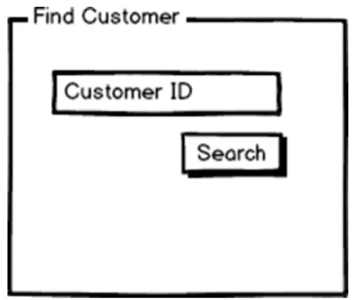

# DDD Layered Arch

## Presentation

Responsible for providing the **user interface** to accomplish a set of tasks.

- **View Model** - any data that populates the presentation layer
- **Input Model** - any input that triggers a backend action

## Application Layer

Reports to the presentation => serve ready-to-use-data in the required form

Orchestrates tasks triggered by the presentation elements => Use-cases of the application's front-end

Doublely-linked with presentation => Possibly extended or duplicated when a new frontend is added

Orchestrator

```c#
public class HomeController
{
    private readonly IHomeApplicationService _service;

    public HomeController()
    {
        _service = service;
    }
    public ActionReqult Index()
    {
        var model = _service.FillHomePage(/* input model */);
        return View(model);
    }
    ...

}
```

Application Layer classes are hoisted in the **Controller**; this ensures processing happens in total isolation outside the http context, as a result this ensures testability.

- **IHomeApplicationService**
- **_service.FillHomePage**

The relationship between the Presentation and Application layers must be established up-front. Each form has an underlying data model that becoming the inputs to the methods invoked in the application layer.

The result of each **Application Layer** method is just the content that's used to fill up the next screen displayed to the user.

Example.

Find Customer => Customer

```c#
public class InputModel
{
    string Id {get; set;}
}
public class CustomerService
{
    ViewModel Search(InputModel m);
}
```

"_Find Customer UI_"



## Buisiness Logic

Business logic has a general life-cycle of:

1. Learn the language of the business domain
1. Split the business domain in bounded contexts
1. Crunch knowledge about the business domain

Business rules are usually implemented in the form of:

- Business Logic Workflows
- Business Logic Components
- Business Rule Engine
- Domain Model
