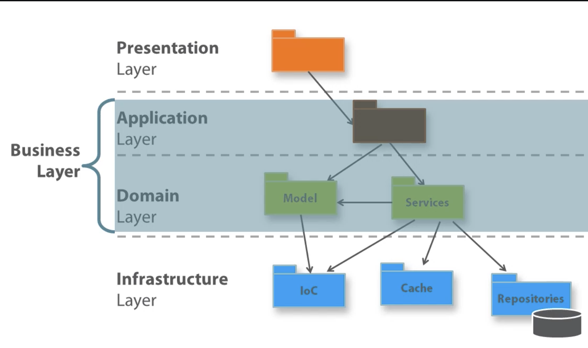

# DDD

Domain Driven Design:

- Presentation
- Application
- Domain
- Infrastructure

This pattern takes shape in the form of:

- Hexagonal Architecture
- Clean Architecture
- Onion Architecture

DDD has 2 distinct parts, you always *need one* but can ignore the other.

- analytical - benefits everybody and every project
- strategic - one of _many_ possible supporting architectures

## Terms

- **Presentation** - ?
- **Application** - ?
- **Domain** - ?
- **Infrastructure** - ?
- **Ubiquitous Language** - Vocabulary of terms - Nouns, Verbs, adjectives, idomatic expressions and even adverbs; shared by all parties involved in the project (to avoid misunderstandings).
- **Bounded Context** - ?
- **Context Mapping** - ?
- **Event Storming** - ?

### Ubiquitous Language

- **Common Vocabulary** - Nouns, Verbs, Adjectives, idomatic expressions and even adverbs; shared by all parties

#### Motivation

- common language, terminology, making sense of user requirements
- Natural language (not artificial), Derived from interviews and brainstorming, Iteratively composed and refined along the way, Unambiguous and fluent ( meets expectations of domain experts & and technical people).
- used everywhere - User Stories, RFC, emails, technical docs, source code

#### Structure

- Glossary of terms
  - saved to office docs
  - Terms fully explained
  - Made available to everyone
  - Part of the project documentation
  - Continuously Updated (generally devs)
  - Changes to the language implies changes to source

#### Discovering the Ubiquitous Language

Discovering the ubiquitous language leads you to understand the business domain in order to design a model.

#### Start from user requirements

Example.

_"As a **registered customer** of the **I-Buy-Stuff** online store, I can **redeem** a **voucher** for an **order** I **place** so that I don't actually **pay** for the **ordered items** myself"_

Pulling the nouns & verbs from this story we have:

- **registered customer**
- **I-Buy-Stuff**
- **redeem**
- **voucher** - domain name
- **order**
- **place**
- **pay**
- **ordered items**

### Bounded Context

A delimited space where an element has a well-defined meaning, any elements of te ubiquitous language.

Beyond the boundaries of the context, the language changes; each bounded context has its own ubiquitous language.

### Core

Core Layer (domain) and everything else builds on top.

Model for the domain - leveraging ubiquitous language && bounded context

## Layered Architecture

[Layered Architecture](ddd-layered-arch.md)

## Domain Model Supporting Architecture

[Domain Model Supporting Architecture](ddd-domain-arch.md)
